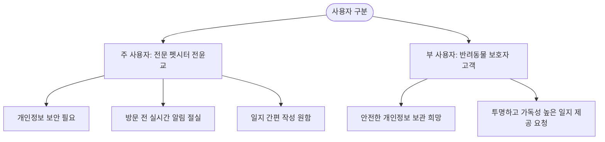
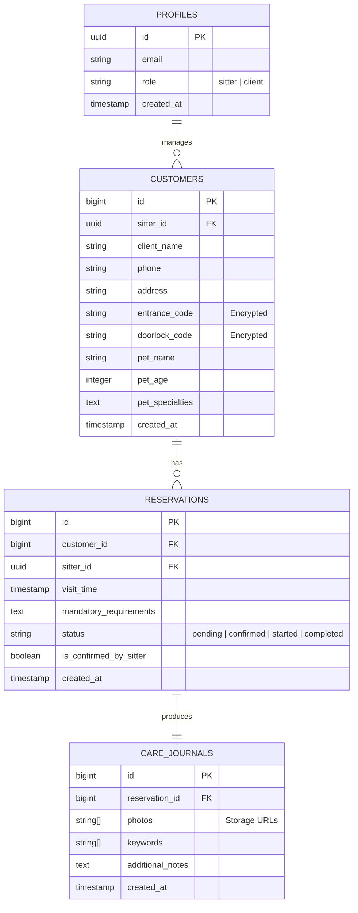

# 📄 [Yoongyopoomae] 윤교품애 - 펫시터 예약 및 고객 관리 서비스 PRD

---

## 1. 목적 및 배경 (Why)

### 1.1 문제 정의 (Problem Statements)
1. **민감 개인정보 노출 및 수동 관리의 한계**: 재방문 고객이 늘어남에 따라 각 가정의 상세 주소, 공동현관 번호, 도어락 비밀번호 및 예민한 반려동물의 정보 등을 메모장이나 수동 문서로 관리하고 있어, **보안 위협이 높고 체계적인 조회가 불가능**합니다.
2. **방문 직전 필수 정보 미숙지 및 심리적 부담**: 노령묘/노령견, 투약이 필요한 동물 등 특이사항이 많은 돌봄 특성상 방문 직전 필수 요청사항(투약 정보, 주의사항, 선호 산책로 등)을 메신저 대화방에서 일일이 검색해 확인해야 하므로 **펫시터의 심리적 부담감이 크고 실수의 위험이 상존**합니다.
3. **돌봄 일지 작성의 시간적 피로도**: 돌봄 서비스가 끝난 후 여러 장의 사진과 장문의 피드백 텍스트를 조합해 메신저로 일지를 전송하는 프로세스가 **펫시터의 퇴근 시간을 지연시키고 심각한 업무 피로도를 유발**합니다.

### 1.2 비전 및 목표 (Vision & Objectives)
- **보안성 극대화**: 민감한 고객 정보를 암호화 저장하고 안전하게 열람할 수 있는 시스템을 도입하여 고객 신뢰도와 물리적 보안을 대폭 강화합니다.
- **사고율 0% 지향**: 방문 전 '필수 주의사항 미리 알림 및 확인(Confirm) 강제 프로세스'를 통해 인적 오류(Human Error)를 사전에 차단합니다.
- **업무 효율성 2배 향상**: 사진 업로드와 간단한 핵심 키워드 선택만으로 깔끔한 양식의 돌봄 일지를 반자동 생성해 주는 시스템을 구축하여 **일지 작성 시간을 기존 대비 50% 이상 단축**시킵니다.

---

## 2. 타겟 사용자 (Who)

### 2.1 주 사용자: 전문 펫시터 (전윤교 돌봄사)
- **특징**: 노령동물 및 케어가 까다로운 아픈 반려동물을 전문으로 돌봅니다. 하루에도 여러 가정을 방문하며 투약 스케줄, 식이 제한 사항 등을 꼼꼼히 챙겨야 합니다.
- **Pain Point**: 이동 중에 수많은 고객의 정보를 파악해야 하며, 돌봄 업무 외에 일지 작성 및 보호자 응대에 너무 많은 에너지가 소모됩니다.

### 2.2 부 사용자: 반려동물 보호자 (고객)
- **특징**: 자신의 소중한 가족인 반려동물을 전문적이고 세심하게 케어해 주길 기대합니다. 가정의 출입문 비밀번호 등 매우 민감한 보안 정보를 펫시터에게 공유해야 합니다.
- **Pain Point**: 정보 유출에 대한 불안감이 있으며, 돌봄 시간 동안 아이가 어떤 상태였는지 상세하고 가독성 있게 전달받고 싶어 합니다.

---

## 3. 핵심 기능 요구사항 (What)

### 3.1 [Must - 구현 완료] 고객 관리 및 개인정보 보안 저장 (Customer Management & Security)
- **고객 프로필 등록 및 조회**:
  - 보호자 정보(이름, 연락처) 및 거주지 상세 주소 등록.
  - 공동현관 출입번호 및 도어락 비밀번호 등록.
  - 반려동물 프로필(이름, 종류, 나이, 체중, 특이사항/질병 유무) 상세 연동.
- **개인정보 암호화 및 마스킹**:
  - 비밀번호 및 상세 주소 등 핵심 민감정보는 **데이터베이스 내에 암호화(Crypto/Symmetric Encryption 또는 pgsodium)**되어 안전하게 보관됩니다.
  - 화면 상에는 기본적으로 `******` 형태로 마스킹 처리되어 나타나며, 펫시터가 생체인식(WebAuthn) 또는 **'2차 비밀번호 확인/터치 바운스 보기'** 버튼을 클릭해야만 일정 시간(예: 30초) 동안 한시적으로 노출됩니다.

### 3.2 [Must - 구현 완료] 방문 전 주의사항 미리 알림 (Pre-visit Safety Dashboard)
- **스마트 스케줄러 & 대시보드 알림**:
  - 방문 스케줄 기반, 지정된 시간(방문 1시간 전)에 대시보드 최상단에 **맞춤형 긴급 팝업/배너** 노출.
- **필수 주의사항 강조 (Critical Warnings)**:
  - 예: *"오늘 15시 보리 - 신부전 유도 약물 0.5cc 급여 필수! 특정 산책 경로 외 출입 금지!"* 등 필수 인지 사항을 붉은색 고대비 UI로 최상단에 강제 고정.
- **확인 승인(Confirm & Check-in) 루프**:
  - 펫시터가 해당 주의사항 체크박스를 직접 체크하고 `[모든 주의사항을 숙지하였으며, 돌봄을 시작합니다]` 버튼을 탭해야만 예약 상태가 `진행 중(Started)`으로 변경되며 서비스 시작이 가능하도록 흐름 제어.

### 3.3 [Should - 구현 완료] 돌봄 일지 간편 작성 및 정리 (Easy Care Journal Generator)
- **사진 업로드**:
  - 현장에서 촬영한 사진(급여 모습, 배변 상태, 노는 모습 등)을 모바일 기기에서 즉시 다중 업로드 (Supabase Storage와 연동).
- **키워드 기반 일지 반자동 생성**:
  - 복잡한 텍스트 타이핑 대신 **카테고리별 간편 키워드 체크리스트** 제공:
    - **식사**: [완식], [일부 남김], [사료 거부], [약 복용 완료]
    - **활동**: [산책 완료(20분)], [실내 놀이], [컨디션 좋음], [무기력함]
    - **배변**: [소변 양호], [대변 양호], [설사/묽은변], [배변 없음]
  - 펫시터가 키워드들을 선택하고 추가 코멘트를 간단히 적으면, 시스템이 자동으로 이를 조합하여 **가독성이 극대화된 템플릿 일지** 완성.
- **즉시 공유 시스템**:
  - 생성된 돌봄 일지를 고유 링크(URL) 형태로 생성하여 보호자에게 카카오톡/SMS로 간편하게 전송할 수 있는 공유 링크 클립보드 복사 기능 제공.

### 3.4 [Should - 구현 완료] 블로그 게시글 수정 및 관리 기능 (Blog Post Edit & Management)
- **게시글 수정 기능 (Edit Post)**:
  - 펫시터(Admin) 권한을 가진 사용자는 작성한 포스트(돌봄 일지, 사진첩, 전문가 팁)에 대해 수정 작업을 수행할 수 있습니다.
  - 포스트 카드 내 '수정' 버튼 클릭 시, 기존 정보(카테고리, 제목, 이미지 URL, VIP 전용 잠금 설정, 본문 내용)가 자동으로 폼에 로드된 상태로 수정 모달이 열립니다.
  - 수정된 데이터는 Supabase DB(또는 로컬 시뮬레이션 데이터)에 즉시 반영되어 변경 내용이 실시간 갱신됩니다.
- **통합 입력 UI**:
  - 등록과 수정에 동일한 모달 폼 UI를 활용하되, 동작 모드(등록/수정)에 맞추어 타이틀 및 버튼 문구가 동적으로 변경됩니다.

### 3.5 [Must - 구현 완료] Google Login 연동 (Google Authentication)
- **자체 회원가입/로그인 기능 제거**: 이메일/비밀번호 기반의 번거로운 회원가입 및 로그인 절차를 전면 삭제하여 물리적 보안 위협을 낮추고 사용자 편의성을 높입니다.
- **Google OAuth 2.0 연동**: Supabase Auth의 Google Social Provider를 활용하여, 안전한 원클릭 Google 로그인 기능으로 교체합니다.
- **가상 시뮬레이션 모드 (데모 환경)**: Supabase 프로젝트가 연결되지 않았거나 로컬 테스트 중인 경우에도 원활한 기능 검증이 가능하도록, '펫시터(Admin)'와 '일반 회원(VIP)' 역할을 선택하여 가상으로 구글 로그인을 진행할 수 있는 시뮬레이션 모드를 구축합니다.
- **역할(Role) 정책 연동**: 구글 로그인 성공 시 Supabase Auth 트리거를 통해 `public.profiles` 테이블에 프로필이 자동 생성되며, 일반 사용자는 `member` 등급을 부여받아 회원 전용 포스트를 즉시 열람할 수 있게 됩니다. `sitter@yenu.com` 이메일로 로그인하는 경우 관리자(`admin`) 등급이 부여되어 대시보드 권한을 얻습니다.

### 3.6 [Must - 구현 완료] 실시간 캘린더 예약 및 요금안내/추가 요금 정책 (Real-time Calendar Booking & Detailed Pricing)
- **실시간 캘린더 예약 폼**:
  - 보호자가 원하는 날짜와 시간대(타임슬롯)를 선택하여 예약을 신청할 수 있습니다.
  - 반려동물 이름, 반려동물 나이, 상세 요청 사항을 입력받고 기본 방문안내와 추가 요금 옵션들을 체크박스로 제공합니다.
- **돌봄 시간 및 요금 정책**:
  - **기본 서비스**: 1일 1회 약 30분 방문 기준 기본 요금 **17,000원**.
  - **결제 방식 및 조건**: 선불결제이며, 결제 완료 시 예약이 확정됩니다. 미결제 시 방문 불가합니다.
  - **법정 공휴일 및 명절 (신정, 설, 추석)**: 공휴일 요금 적용 **(+5,000원)** 할증.
- **추가 서비스 요금**:
  - **사전 만남**: 10,000원
  - **투약 1회**: 5,000원
  - **급여도움 (강제급여) 1회**: 10,000원 (일반 투약보다 시간이 더 소요되며 아이 안전을 위해 세심한 케어가 필요한 전문 케어)
  - **병원 방문 1회**: 20,000원
  - **외 지역 추가요금**: 5,000원
  - **강아지 1마리 추가**: 8,000원
  - **1일 2회 방문**: 13,000원
  - **안내 사항**: 다묘가정 및 강아지가 함께 있는 가정의 경우 돌봄 난이도에 따라 추가요금이 발생할 수 있음을 사전 고지합니다.
- **방문 가능 지역 및 추가 요금**:
  - **기본 방문 지역**: 거제 전지역 중 **고현, 장평, 상문, 수월, 중곡, 옥포, 아주, 사곡**은 기본 방문 가능 지역으로 설정하며 추가금이 발생하지 않습니다.
  - **그외 지역**: 기본 지역을 제외한 그외 모든 지역(거제 타 지역 및 타 시/군 등)은 예약 신청 시 **외 지역 추가요금 (+5,000원)**이 자동으로 발생합니다.
- **지역 선택 UI 및 요금 자동 연동**:
  - 예약 폼에 '방문 지역' 선택 필드를 제공합니다 (기본 지역 8곳 및 '기타 지역' 옵션).
  - '기타 지역'을 선택할 경우 사용자가 직접 지역명을 입력할 수 있는 텍스트 필드가 동적으로 나타납니다.
  - 선택한 지역 및 체크박스 추가 서비스 옵션들에 따라 추가금 발생 여부와 최종 예상 요금을 화면에 실시간으로 시각화하여 보호자에게 고지합니다.
  - 예약 성공 시 나타나는 예약 접수 상세 요약 모달과 펫시터 관리 대시보드의 예약 목록에 선택된 옵션 목록 및 최종 결제 금액이 명확하게 표기됩니다.

---

### 3.7 [Must - 구현 완료] 예약 시 반려동물 건강 상태 체크 및 사전 정보 수집
- **건강 상태 체크 (Health Check)**:
  - **30일 이내 병원 방문 여부**: 라디오 버튼(있음/없음)으로 선택. 있음 선택 시 방문 날짜 및 진료 내용을 직접 입력하는 텍스트 필드가 동적으로 표시됩니다.
  - **전염성 질환 여부**: 라디오 버튼(있음/없음)으로 선택. 있음을 선택하면 예약 제출이 차단되며 "완치 후 재신청" 안내 메시지가 표시됩니다.
  - ※ 질병 미고지로 인한 문제 발생 시 펫시터는 책임지지 않습니다.
- **방문 면책 동의 (Health Agreement)**:
  - 방문탁묘 서비스 특성상 질병 잠복기(3~14일) 또는 기존 건강 상태(스트레스)로 인해 방문 이후 질병이 발생할 수 있으며, 보호자는 이를 이해하고 펫시터에게 감염 책임을 묻지 않음에 동의하는 체크박스를 예약 폼에 제공합니다.
  - 동의 미체크 시 예약 제출이 차단됩니다.
- **반려동물 성격 (Pet Personality)**:
  - 사람 좋아함, 낯가림 있음, 겁이 많음, 공격성 있음, 만지는 거 싫어함 중 복수 선택 가능한 토글 칩 UI.
  - 기타 성격 특이사항은 자유 텍스트로 직접 입력 가능.
  - 선택된 항목은 펫시터 대시보드의 "🐾 반려동물 상세 정보" 카드에 태그 형태로 표시됩니다.
- **사료 급여 방법 (Feeding Info)**:
  - 그릇 위치, 급여 방법, 물 종류(정수/수돗물), 간식 알러지 여부 등을 보호자가 직접 주관식으로 기재합니다.
- **화장실 관리 방법 (Litter Info)**:
  - 모래 종류, 처리 방법, 화장실 위치 등을 보호자가 직접 주관식으로 기재합니다.
- **펫시터 대시보드 연동**:
  - 예약 확정 시 위 정보들이 `sitterReservations` 데이터에 포함되어 저장됩니다.
  - 대시보드의 "🐾 반려동물 상세 정보" 카드에 병원 방문 여부, 전염성 질환, 성격 태그, 사료 급여법, 화장실 관리법이 명확하게 표시됩니다.

---

## 4. 데이터베이스 및 테이블 설계 (Supabase Database Schema)

### 4.1 테이블 상세 사양 (Data Dictionary)

#### 1) `customers` (고객 및 반려동물 정보)
- 민감 정보인 `entrance_code`(공동현관 비밀번호) 및 `doorlock_code`(도어락 비밀번호)는 DB 상에 **암호화 알고리즘**을 활용해 이진/텍스트 데이터로 보존합니다.

#### 2) `reservations` (예약 일정 및 주의사항)
- `is_confirmed_by_sitter` 속성이 `TRUE`여야만 `status`가 `started`로 진입할 수 있도록 제약 조건을 설정합니다.

#### 3) `care_journals` (돌봄 일지)
- `photos`: Supabase Storage 버킷에 담긴 이미지 경로 어레이.
- `keywords`: 펫시터가 선택한 핵심 활동 태그들.

---

## 5. UI/UX 및 디자인 시스템 (Design Aesthetics)

> [!TIP]
> **따뜻하고 믿음직한 에이전트 브랜딩**: 
> 노령동물과 아픈 동물을 케어하는 펫시터의 세심하고 신뢰감 넘치는 이미지를 시각화하기 위해 **"Warm Sand & Deep Navy"**의 조합으로 신뢰감과 편안함을 동시에 전달합니다. (기존 임시 브랜드명 'Vibe Cat Care'는 공식 브랜드인 한글 **'윤교품애'**로 최종 일체화 정렬 완료되었으며, 이에 맞추어 신규 고양이 캐릭터 디자인의 **윤교품애 공식 브랜드 로고 이미지**가 메인 포털 헤더 및 브릿지 게이트웨이에 전면 적용되었습니다.)

- **Warm Sand (포근한 모래색)**: `hsl(38, 50%, 96%)` - 전체 백그라운드 및 메인 보조 톤. 반려동물이 주는 편안함 표현.
- **Deep Navy (신뢰의 네이비)**: `hsl(215, 60%, 18%)` - 주요 텍스트 및 주 버튼 톤. 보안과 전문성 강조.
- **Warning Coral (경고용 코랄)**: `hsl(12, 85%, 60%)` - 방문 전 주의사항 및 미작동 알림에 사용되는 가독성 높은 코랄 레드.
- **Mint Sage (완료 및 체크)**: `hsl(150, 45%, 40%)` - 돌봄 진행 및 완료 상태를 나타내는 부드러운 그린.

### 5.1 핵심 스크린 플로우 (User Interfaces)

1. **로그인 후 메인 대시보드**:
   - 상단에 **"오늘 예정된 돌봄: N건"** 정보 표시.
   - 방문 1시간 전인 예약이 있을 경우, 대시보드 전체가 **Warning Coral 테두리의 경고 배너**로 덮이며 필수 확인을 유도함.
2. **보안 고객 카드**:
   - 공동현관 및 도어락 필드는 마스킹(`••••`) 처리되어 있으며, 마우스 호버 및 `열람 2차 확인`을 터치할 시 30초 카운트다운 타이머와 함께 노출됨.
3. **간편 일지 작성 패널**:
   - 큼직하고 터치하기 쉬운 모바일 친화형 칩(Chip) 컴포넌트로 구성된 키워드 선택 존.
   - 키워드 클릭 즉시 하단 미리보기 컴포넌트에서 보호자에게 보여질 카드 형태의 돌봄 일지가 동적으로 조립되어 펫시터에게 확인 기회를 줌.

---

## 6. 제외 범위 (Out of Scope - MVP)
- **자체 실시간 채팅 기능**: 카카오톡 알림톡/SMS 공유 링크 제공으로 대체.
- **자체 결제 연동 (PG사 결제)**: 계좌 이체 및 수동 정산 시스템으로 유지.
- **보호자 전용 대시보드 앱**: 보호자는 로그인 없이 고유 링크를 통해 돌봄 일지 웹 페이지를 단독 조회하는 간이 뷰어 페이지만 지원.

---

## 7. 성공 지표 (Success Metrics)
- **일지 작성 시간 감소**: 평균 일지 작성 시간 **15분 ➡️ 5분 미만**으로 단축 (70% 시간 감소 목표).
- **주의사항 인적 실수율**: 예약 시간 직전 주의사항 미확인으로 인한 이슈 발생 건수 **0건**.
- **고객 보안 만족도**: 보호자 피드백 설문 조사 시 "비밀번호 등 개인정보 보관 방식에 매우 만족함" 답변 비율 95% 이상 달성.
