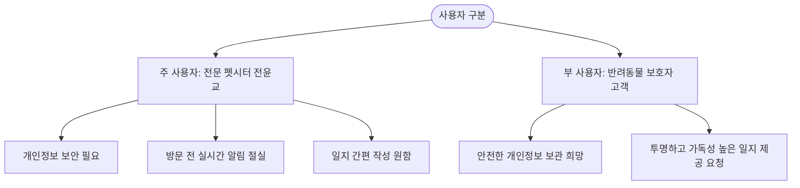
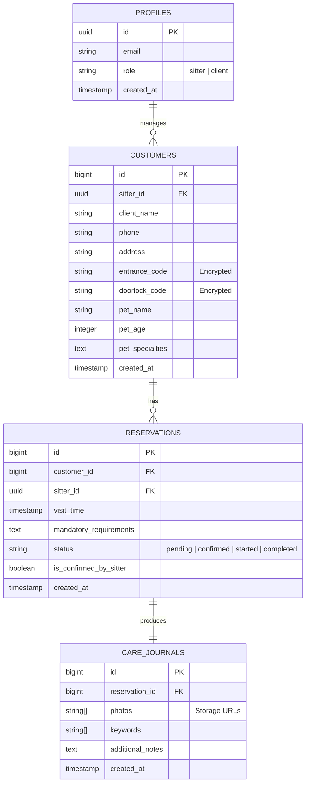

# 📄 [Yoongyopoomae] 윤교품애 - 펫시터 예약 및 고객 관리 서비스 PRD

---

## 1. 목적 및 배경 (Why)

### 1.1 문제 정의 (Problem Statements)

1. **민감 개인정보 노출 및 수동 관리의 한계**: 재방문 고객이 늘어남에 따라 각 가정의 상세 주소, 공동현관 번호, 도어락 비밀번호 및 예민한 반려동물의 정보 등을 메모장이나 수동 문서로 관리하고 있어, **보안 위협이 높고 체계적인 조회가 불가능**합니다.
2. **방문 직전 필수 정보 미숙지 및 심리적 부담**: 노령묘/노령견, 투약이 필요한 동물 등 특이사항이 많은 돌봄 특성상 방문 직전 필수 요청사항(투약 정보, 주의사항, 선호 산책로 등)을 메신저 대화방에서 일일이 검색해 확인해야 하므로 **펫시터의 심리적 부담감이 크고 실수의 위험이 상존**합니다.
3. **돌봄 일지 작성의 시간적 피로도**: 돌봄 서비스가 끝난 후 여러 장의 사진과 장문의 피드백 텍스트를 조합해 메신저로 일지를 전송하는 프로세스가 **펫시터의 퇴근 시간을 지연시키고 심각한 업무 피로도를 유발**합니다.
4. **보호자(고객)의 예약 진입장벽**: 이용 가능한 시간대를 직접 확인하고, 원하는 서비스와 추가 옵션을 선택하며, 최종 요금을 예측하는 전 과정이 단일 채널(카카오톡 문의)에 의존하여 **보호자의 예약 진입 장벽이 높고, 펫시터의 상담 업무 부담도 가중**됩니다. 재신청 고객이 매번 동일한 개인정보와 반려동물 정보를 반복 입력해야 하는 비효율도 해소가 필요합니다.

### 1.2 비전 및 목표 (Vision & Objectives)

- **보안성 극대화**: 민감한 고객 정보를 암호화 저장하고 안전하게 열람할 수 있는 시스템을 도입하여 고객 신뢰도와 물리적 보안을 대폭 강화합니다.
- **사고율 0% 지향**: 방문 전 '필수 주의사항 미리 알림 및 확인(Confirm) 강제 프로세스'를 통해 인적 오류(Human Error)를 사전에 차단합니다.
- **업무 효율성 2배 향상**: 사진 업로드와 간단한 핵심 키워드 선택만으로 깔끔한 양식의 돌봄 일지를 반자동 생성해 주는 시스템을 구축하여 **일지 작성 시간을 기존 대비 50% 이상 단축**시킵니다.

---

## 2. 타겟 사용자 (Who)


```mermaid
graph TD
    User([사용자 구분]) --> Sitter[주 사용자: 전문 펫시터 전윤교]
    User --> Client[부 사용자: 반려동물 보호자 고객]

    Sitter --> S_1["개인정보 보안 필요"]
    Sitter --> S_2["방문 전 실시간 알림 절실"]
    Sitter --> S_3["일지 간편 작성 원함"]

    Client --> C_1["안전한 개인정보 보관 희망"]
    Client --> C_2["투명하고 가독성 높은 일지 제공 요청"]
```

### 2.1 주 사용자: 전문 펫시터 (전윤교 돌봄사)

- **특징**: 노령동물 및 케어가 까다로운 아픈 반려동물을 전문으로 돌봅니다. 하루에도 여러 가정을 방문하며 투약 스케줄, 식이 제한 사항 등을 꼼꼼히 챙겨야 합니다.
- **Pain Point**: 이동 중에 수많은 고객의 정보를 파악해야 하며, 돌봄 업무 외에 일지 작성 및 보호자 응대에 너무 많은 에너지가 소모됩니다.

### 2.2 부 사용자: 반려동물 보호자 (고객)

- **특징**: 자신의 소중한 가족인 반려동물을 전문적이고 세심하게 케어해 주길 기대합니다. 가정의 출입문 비밀번호 등 매우 민감한 보안 정보를 펫시터에게 공유해야 합니다.
- **Pain Point**: 정보 유출에 대한 불안감이 있으며, 돌봄 시간 동안 아이가 어떤 상태였는지 상세하고 가독성 있게 전달받고 싶어 합니다.
- **고객 여정 (Customer Journey)**:
  1. 서비스 소개 및 요금 확인 → 2. 이용 가능 날짜/시간대 확인 → 3. 실시간 예상 요금 계산 → 4. 예약 신청 (신규/재신청 구분) → 5. 건강상태 체크 & 개인정보 동의 → 6. 예약 완료 확인 → 7. 돌봄 일지 수신 (링크/카카오톡)

---

## 3. 핵심 기능 요구사항 (What)

### 3.1 [Must - 구현 완료] 고객 관리 및 개인정보 보안 저장 (Customer Management & Security)

- **고객 프로필 등록 및 조회**:
  - 보호자 정보(이름, 연락처) 및 거주지 상세 주소 등록.
  - 공동현관 출입번호 및 도어락 비밀번호 등록.
  - 반려동물 프로필(이름, 종류, 나이, 체중, 특이사항/질병 유무) 상세 연동.
- **개인정보 암호화 및 마스킹**:
  - 비밀번호 및 상세 주소 등 핵심 민감정보는 **데이터베이스 내에 암호화(Crypto/Symmetric Encryption 또는 pgsodium)**되어 안전하게 보관됩니다.
  - 화면 상에는 기본적으로 `******` 형태로 마스킹 처리되어 나타나며, 펫시터가 생체인식(WebAuthn) 또는 **'2차 비밀번호 확인/터치 바운스 보기'** 버튼을 클릭해야만 일정 시간(예: 30초) 동안 한시적으로 노출됩니다.

### 3.2 [Must - 구현 완료] 방문 전 주의사항 미리 알림 (Pre-visit Safety Dashboard)

- **스마트 스케줄러 & 대시보드 알림**:
  - 방문 스케줄 기반, 지정된 시간(방문 1시간 전)에 대시보드 최상단에 **맞춤형 긴급 팝업/배너** 노출.
- **필수 주의사항 강조 (Critical Warnings)**:
  - 예: _"오늘 15시 보리 - 신부전 유도 약물 0.5cc 급여 필수! 특정 산책 경로 외 출입 금지!"_ 등 필수 인지 사항을 붉은색 고대비 UI로 최상단에 강제 고정.
- **확인 승인(Confirm & Check-in) 루프**:
  - 펫시터가 해당 주의사항 체크박스를 직접 체크하고 `[모든 주의사항을 숙지하였으며, 돌봄을 시작합니다]` 버튼을 탭해야만 예약 상태가 `진행 중(Started)`으로 변경되며 서비스 시작이 가능하도록 흐름 제어.
  - **고양이별 동적 체크리스트 제공 (1번 주의사항 항목)**:
    - 체크리스트 1번 주의사항은 고정된 문구가 아닌, **현재 활성화된 예약의 고양이별 맞춤 주의사항**을 동적으로 렌더링합니다.
    - 해당 고객의 특별 지침(`specialties`)이 존재하면 이를 인지했다는 내용(예: _"1. 보호자 특별 지침: [고양이 이름] - [특이사항 및 주의사항]을 온전히 인지하였습니다."_)으로 표시합니다.
    - 만약 지정된 특별 지침이 없을 경우에는 예약 시 입력받은 필수 요구사항(`mandatory_requirements` 또는 요청사항)이나, 이마저도 없을 경우 공통 주의사항(예: _"1. 사료/물 급여 수칙 및 아이 맞춤형 기본 돌봄 지침을 온전히 인지하였습니다."_)을 출력하여 펫시터가 대상 반려동물의 개별 주의사항을 확실히 인지하고 시작하도록 제어합니다.

### 3.3 [Should - 구현 완료] 돌봄 일지 간편 작성 및 정리 (Easy Care Journal Generator)

- **사진 업로드**:
  - 현장에서 촬영한 사진(급여 모습, 배변 상태, 노는 모습 등)을 모바일 기기에서 즉시 다중 업로드 (Supabase Storage와 연동).
- **키워드 기반 일지 반자동 생성**:
  - 복잡한 텍스트 타이핑 대신 **카테고리별 간편 키워드 체크리스트** 제공:
    - **식사**: [완식], [일부 남김], [사료 거부], [약 복용 완료]
    - **활동**: [실내 놀이 완료], [산책 완료 (20분)], [컨디션 좋음], [무기력함]
    - **배변**: [소변 양호], [대변 양호], [설사/묽은변], [배변 없음]
  - 펫시터가 키워드들을 선택하고 추가 코멘트를 간단히 적으면, 시스템이 자동으로 이를 조합하여 **가독성이 극대화된 템플릿 일지** 완성.
- **즉시 공유 시스템**:
  - 생성된 돌봄 일지를 고유 링크(URL) 형태로 생성하여 보호자에게 카카오톡/SMS로 간편하게 전송할 수 있는 공유 링크 클립보드 복사 기능 제공.
- **돌봄 일지 확인 및 홈화면 연동 발행 (Auto-Post to Home Logs)**:
  - 돌봄 일지 빌더 하단의 `[돌봄 일지 작성 확인 및 홈화면 등록 🏁]` 버튼 클릭 시, 작성된 일지가 데이터베이스에 기록됨과 동시에 홈화면의 돌봄일지 게시글(`posts`)로 자동 발행되어 리스트에 노출됩니다.
  - **회원 전용 접근 제한 (Restricted to Members)**: 자동 등록되는 포스트는 `is_restricted` 속성이 `true`로 고정됩니다. 비로그인 사용자나 외부 방문자는 포스트 카드 클릭 시 "멤버/VIP 전용 포스트" 안내창이 노출되며 열람이 제한되고, **로그인하여 인증된 윤교품애 회원(Member/Admin 등)만** 클릭하여 돌봄 일지의 상세 내용 및 사진을 정상적으로 조회할 수 있습니다.

### 3.4 [Should - 구현 완료] 블로그 게시글 수정 및 관리 기능 (Blog Post Edit & Management)

- **게시글 상세 보기 (Post Detail View - 모달 팝업창)**:
  - 히어로 페이지 및 블로그 섹션에서 게시글 카드 또는 [▼ 클릭하여 전체 읽기] 클릭 시, 페이지 이동이나 새 창 열기 없이 그 자리에서 전체 내용을 확인할 수 있는 프리미엄 모달 팝업창이 화면 중앙에 나타납니다.
  - 모달 창 안에는 해당 일지의 전체 내용(카테고리 태그, 제목, 작성자, 작성일, 업로드된 이미지, 줄바꿈이 완벽히 지원되는 전체 본문)이 모두 노출되며, 이미지는 원본 비율을 유지하면서 찌그러지거나 잘리지 않도록 `width: 100%; height: auto; object-fit: contain;` 속성으로 상단에 유연하게 배치됩니다. 또한 사용자가 입력한 HTML 및 스크립트 코드(예: `<svg onload=...>`)가 임의로 실행되지 않도록 안전하게 텍스트(문자열)로만 렌더링(이스케이프 및 태그 스트립)되는 보안 처리가 적용됩니다.
  - 모달 창 우측 상단의 [X] 버튼이나 하단의 [닫기] 버튼을 통해 창을 닫을 수 있으며, 모달 창 바깥의 반투명 어두운 배경(Backdrop) 영역을 클릭해도 자동으로 창이 닫힙니다.
  - **반응형 레이아웃 및 팝업 최적화**: 모달 창의 너비는 모바일, 태블릿, 데스크톱 등 환경에 맞춰 `width: 90%`, `max-width: 650px` 비율로 유연하게 대응하며, 화면 너비에 따라 내부 패딩(Padding)과 폰트 크기가 자연스럽게 스케일링(clamp 함수 사용 등)되어 디바이스 크기에 상관없이 최적의 레이아웃을 보장합니다.
  - **사진 클릭 시 원본 이미지 확대 팝업(Lightbox)**: 상세 모달창 및 상세 페이지 내 고양이 사진 우측 하단에 `원본 이미지 (클릭 시 전체크기)` 안내 배지를 배치하고, 사진을 클릭하면 전체 화면을 덮는 고해상도 라이트박스 팝업(Z-Index 2000)이 생성됩니다. 확대된 이미지 역시 화면을 넘치지 않고 원본 비율이 유지되며, 외부배경 영역이나 닫기 버튼 클릭으로 쉽게 해제할 수 있습니다.
- **게시글 수정 기능 (Edit Post)**:
  - 펫시터(Admin) 권한을 가진 사용자는 작성한 포스트(돌봄 일지, 사진첩, 전문가 팁)에 대해 수정 작업을 수행할 수 있습니다.
  - 포스트 카드 내 '수정' 버튼 클릭 시, 기존 정보(카테고리, 제목, 이미지 URL, VIP 전용 잠금 설정, 본문 내용)가 자동으로 폼에 로드된 상태로 수정 모달이 열립니다.
  - 수정된 데이터는 Supabase DB(또는 로컬 시뮬레이션 데이터)에 즉시 반영되어 변경 내용이 실시간 갱신됩니다.
- **통합 입력 UI**:
  - 등록과 수정에 동일한 모달 폼 UI를 활용하되, 동작 모드(등록/수정)에 맞추어 타이틀 및 버튼 문구가 동적으로 변경됩니다.

### 3.5 [Must - 구현 완료] 다중 역할 인증 및 권한 모델 (Multi-Role Authentication & Access Control)

- **3대 역할(Role) 분리 정의**:
  - **일반 회원 (Member)**:
    - Google 로그인을 통해 가입 및 인증한 기본 등급입니다.
    - 권한 범위: 제한 게시글(VIP/멤버 전용)을 포함한 모든 블로그 글 열람, 실시간 예약 신청, 그리고 **본인(user_id가 본인 ID인 경우)이 직접 작성한 블로그 포스트에 대해서만 수정 및 삭제**가 가능합니다.
  - **펫시터 (Sitter)**:
    - 돌봄 실무를 직접 수행하는 펫시터 등급입니다.
    - 권한 범위: 펫시터 전용 보안 대시보드 접근 권한을 얻으며, 대시보드 내 캘린더 및 리스트에서 **일정을 확인하고 특정 예약에 대한 "돌봄 시간 조절 및 수정(Visit Time Update)"을 수행**할 수 있습니다. 일반 게시글에 대한 생성/수정/삭제 권한은 제한됩니다.
  - **관리자 (Admin)**:
    - 시스템의 전권을 쥐고 있는 어드민 등급입니다.
    - 권한 범위: 펫시터 전용 대시보드를 포함한 모든 포탈 접근 권한을 가지며, **블로그의 모든 포스트 열람, 수정, 삭제**가 가능하고 모든 돌봄 예약 일정을 관리 및 수정할 수 있습니다.
- **가상 시뮬레이션 모드 (데모 환경)**:
  - Supabase 프로젝트가 연결되지 않았거나 로컬 테스트 중인 경우에도 역할별 권한 검증이 가능하도록, '일반 회원 (Member)', '펫시터 (Sitter)', '관리자 (Admin)' 역할을 선택하여 가상으로 구글 로그인을 진행할 수 있는 시뮬레이션 로그인 토글을 지원합니다.
- **DB RLS 정책 및 이메일 연동**:
  - `sitter@yenu.com` 계정으로 가입/로그인 시 자동으로 **관리자(Admin)** 등급이 부여됩니다.
  - `petsitter@yenu.com` 계정으로 가입/로그인 시 자동으로 **펫시터(Sitter)** 등급이 부여됩니다.
  - 그 외 구글 가입 계정은 기본적으로 **일반 회원(Member)** 권한으로 바인딩되어 데이터베이스 RLS(Row Level Security) 정책과 완벽히 동기화됩니다.

### 3.6 [Must - 구현 완료] 실시간 캘린더 예약 및 요금안내/추가 요금 정책 (Real-time Calendar Booking & Detailed Pricing)

- **실시간 캘린더 예약 폼 및 다중 방식 예약**:
  - **단일 날짜 예약**: 보호자가 달력에서 특정 하루를 직접 클릭하고, 우측 입력창의 '\* 2. 방문 원하시는 시간 적어주세요 (필수)' 항목에 원하는 시간대를 자유 텍스트로 기재하여 예약을 진행합니다. (기존 30분 단위 고정 타임슬롯 선택 방식 → **우측 텍스트 입력창 일원화 방식**으로 전환)
  - **여러 날 연속/정기 신청**: 시작일과 종료일을 설정하고, 주기(매일/격일 등) 및 방문 날짜 상세 정보를 주관식 텍스트로 기재하여 편리하게 여러 날을 묶어서 신청할 수 있습니다. 다중일 신청 시 적용된 기간 일수에 따라 요금이 자동 합산 계산됩니다.
  - **레이아웃 일관성 유지**: 단일 날짜 예약 및 여러 날 정기 신청 모드에 관계없이, 데스크톱 화면에서 달력(Left Column)과 예약 신청서(Right Column)가 50:50 비율로 나란히 배치(Side-by-Side split layout)되도록 일관된 CSS 레이아웃 구조를 보장합니다. 여러 날 신청 시 달력 날짜를 클릭하더라도 레이아웃이 깨지거나 달력이 화면 전체 너비로 팽창하지 않으며 50:50 배율을 유지합니다.
  - **멀티 스텝(단계별) 폼 구조 (Multi-Step Form Flow)**:
    - 예약 상세 페이지가 길어짐에 따라 사용자의 입력 편의성을 극대화하기 위해 3단계의 멀티 스텝 구조로 분할합니다.
    - **1단계 (Step 1) - 예약 기본 정보**: 신청 유형 선택(신규/재신청), 예약 방식 선택(단일/여러 날), 방문 희망 날짜/시간 입력, 반려동물 이름/마릿수/나이 기재, 기본 서비스 안내, 추가 서비스 선택 항목을 포함합니다. '추가 서비스 선택' 섹션 아래에 예약 디자인 톤에 맞춘 깔끔한 `[다음으로 ➔]` 버튼을 배치하며, 1단계 필수 입력 사항에 대한 유효성 검사를 거쳐 통과 시 2단계로 진행합니다.
    - **2단계 (Step 2) - 건강 상태 체크 (필수)**: 1단계 데이터가 유지된 채 2단계로 전환되며, 30일 이내 병원 방문 여부, 전염성 질환 여부, 그리고 면책 동의 체크박스가 포함됩니다. 있음/없음 및 동의 체크박스를 모두 기입하고 `[다음 단계로 ➔]` 버튼을 누르면 유효성 검사를 거쳐 3단계로 이동하며, 누락 시 "필수 항목을 모두 확인해 주세요" 안내 메시지(validation)를 표시합니다.
    - **3단계 (Step 3) - 돌봄 상세 및 보안 기재, 최종 예약**: 방문 예정 지역 선택 및 필수 개인정보 수집(연락처, 주소, 출입코드 등), 반려동물 성격, 사료 급여 및 화장실 관리 정보, 실시간 예상 이용 요금 상세 명세와 최종 합산 요금을 표시하며, 최하단에는 최종 예약 신청 전송을 위한 `[돌봄 예약 확정하기 📝]` 버튼을 배치합니다.
    - **상태 관리 및 복구**: 각 단계를 자유롭게 오갈 때 입력값이 초기화되지 않고 부모 컴포넌트의 React State로 안전하게 보전 및 동기화됩니다. 이전 단계로 돌아갈 수 있는 `[이전 단계로 돌아가기]` 버튼을 제공하며, 단계 이동 시 예약 시작 위치로 부드럽게 자동 스크롤(Smooth Scroll)됩니다.
- **방문 선호 시간 자유 입력 (Free-Text Preferred Time)**:
  - 기존의 30분 단위 고정 타임슬롯(예약 가능/불가) 선택 버튼 리스트를 **전면 제거**하고, 대신 사용자가 원하는 시간을 자유롭게 입력할 수 있는 **텍스트 입력창**으로 대체 및 일원화했습니다.
  - 입력창 바로 위에는 주황색 테두리의 안내 배너를 배치하여 _"원하시는 선호 시간을 적어주시면, 다른 돌봄 일정 및 동선을 고려하여 조율 후 개별적으로 연락드리겠습니다. ✨"_ 메시지를 친절하게 안내합니다.
  - 단일 날짜 예약 및 여러 날 연속 예약 모두 동일한 자유 입력창(`bookingTimeText` 상태)을 공유하며, 빈 값 입력 시 유효성 검사에서 차단됩니다.
  - 펫시터는 입력된 선호 시간을 참고하여 실제 방문 확정 시간을 고객에게 개별 연락으로 안내합니다.
- **아이들 마릿수 및 중성화 세부 요약**:
  - 대표 동물 이름 외에 돌봄을 받을 전체 반려동물 마릿수(1~5마리 이상)를 기재하며, 상세 설명 란에 아이들의 이름, 나이, 성별, 중성화 여부, 성격 및 특징을 통합하여 기재할 수 있도록 2000자 용량의 텍스트 영역을 제공합니다.
- **실시간 예약 내용 캘린더 표기**:
  - 예약이 접수/확정되면 해당 날짜의 캘린더 셀 내부에 반려동물 이름과 예약 정보를 담은 직관적인 배지 형태로 표기되어, 보호자가 예약 현황을 달력상에서 직관적으로 확인할 수 있습니다. 다중 예약의 경우 예약된 각 날짜의 셀마다 배지가 동적으로 자동 삽입됩니다.
- **이미 예약 완료된 시간대 실시간 중복 차단 (비활성화)**:
  - 특정 날짜에 이미 다른 예약이 확정되어 있는 경우(예: 돌봄 예약 일정이 잡힌 시간 범위), 다른 예약자가 동일한 날짜의 겹치는 시간대 타임슬롯을 선택할 수 없도록 해당 시간 버튼을 `예약 불가 ❌`로 동적 변경 및 비활성화 처리하여 중복 예약을 원천적으로 방지합니다.
- **예약 접수 상세 요약 모달 스크롤 지원 및 달력 연동**:
  - 예약 성공 시 나타나는 예약 접수 상세 요약 모달은 화면 크기(특히 모바일 및 저해상도 기기)에 따라 세로 길이가 길어져 하단의 '확인 및 일정표 돌아가기' 버튼이 화면 밖에 잘려 보이지 않는 현상을 방지하기 위해 모달 자체에 내부 스크롤(`max-height: 90vh` 및 `overflow-y: auto`) 기능을 적용하여 항상 확인 버튼을 끝까지 스크롤하여 클릭할 수 있도록 보장합니다.
  - 모달 하단의 **'확인 및 일정표 돌아가기'** 버튼을 누르면 예약이 완료된 날짜가 달력에 선택된 상태로 유지되며, 해당 날짜의 캘린더 셀 내부에 반려동물 이름 배지(예: `🐾 로니`)가 실시간으로 자동 적용되어 즉시 표시됩니다. 또한, 해당 시간대는 동일한 날짜에서 `예약 불가 ❌` 상태로 즉시 변경됩니다.
- **돌봄 시간 및 요금 정책**:
  - **기본 서비스**: 1일 1회 약 30분 방문 기준 기본 요금 **17,000원**.
  - **결제 방식 및 조건**: 선불결제이며, 결제 완료 시 예약이 확정됩니다. 미결제 시 방문 불가합니다.
  - **법정 공휴일 및 명절 (신정, 설, 추석)**: 공휴일 요금 적용 **(+5,000원)** 할증.
- **추가 서비스 요금**:
  - **사전 만남**: 10,000원
  - **투약 1회**: 5,000원
  - **급여도움 (강제급여) 1회**: 10,000원 (일반 투약보다 시간이 더 소요되며 아이 안전을 위해 세심한 케어가 필요한 전문 케어)
  - **병원 방문 1회**: 20,000원
  - **외 지역 추가요금**: 5,000원
  - **강아지 1마리 추가**: 8,000원
  - **1일 2회 방문**: 13,000원
  - **안내 사항**: 다묘가정 및 강아지가 함께 있는 가정의 경우 돌봄 난이도에 따라 추가요금이 발생할 수 있음을 사전 고지합니다.
- **방문 가능 지역 및 추가 요금**:
  - **기본 방문 지역**: 거제 전지역 중 **고현동, 장평동, 상문동, 수월동, 중곡동, 옥포동, 아주동, 사곡리**는 기본 방문 가능 지역으로 설정하며 추가금이 발생하지 않습니다.
  - **그외 지역**: 기본 지역을 제외한 그외 모든 지역(거제 타 지역 및 타 시/군 등)은 예약 신청 시 **외 지역 추가요금 (+5,000원)**이 자동으로 발생합니다.
  - **시각적 가이드라인 강조**: 실시간 요금 계산기 및 예약 신청서의 지역 안내 텍스트는 시인성이 매우 우수한 전용 알림 상자(Alert Box) 형태로 표시합니다. 어두운 배경(계산기)에서는 연한 금색/노란색 테두리와 하이라이트를, 밝은 배경(예약 신청서)에서는 따뜻한 코랄/오렌지색 테두리와 짙은 대비를 지닌 안내 상자를 배치하여 눈에 잘 띄게 시각화합니다.
- **지역 선택 UI 및 요금 자동 연동**:
  - 예약 폼에 '방문 지역' 선택 필드를 제공합니다 (기본 지역 8곳 및 '기타 지역' 옵션).
  - '기타 지역'을 선택할 경우 사용자가 직접 지역명을 입력할 수 있는 텍스트 필드가 동적으로 나타납니다.
  - 선택한 지역 및 체크박스 추가 서비스 옵션들에 따라 추가금 발생 여부와 최종 예상 요금을 화면에 실시간으로 시각화하여 보호자에게 고지합니다.
  - **요금 계산 로직**: 기본 요금 **17,000원**에 선택된 총 일수(단일 날짜 예약 시 1일, 여러 날 정기 예약 시 시작일~종료일 사이의 실제 방문 횟수)를 곱하고, 추가 서비스 요금 및 공휴일 할증 등 기타 추가금은 일수와 관계없이 일회성 추가 요금으로 1회만 합산하여 최종 예상 요금을 계산합니다. (`최종 예상 요금 = (17,000원 * 선택일수) + 추가 옵션 요금`)

---

### 3.7 [Must - 구현 완료] 예약 시 반려동물 건강 상태 체크 및 사전 정보 수집

- **건강 상태 체크 (Health Check)**:
  - **30일 이내 병원 방문 여부**: 라디오 버튼(있음/없음)으로 선택. 있음 선택 시 방문 날짜 및 진료 내용을 직접 입력하는 텍스트 필드가 동적으로 표시됩니다.
  - **전염성 질환 여부**: 라디오 버튼(있음/없음)으로 선택. 있음을 선택하면 예약 제출이 차단되며 "완치 후 재신청" 안내 메시지가 표시됩니다.
  - ※ 질병 미고지로 인한 문제 발생 시 펫시터는 책임지지 않습니다.
- **방문 면책 동의 (Health Agreement)**:
  - 방문탁묘 서비스 특성상 질병 잠복기(3~14일) 또는 기존 건강 상태(스트레스)로 인해 방문 이후 질병이 발생할 수 있으며, 보호자는 이를 이해하고 펫시터에게 감염 책임을 묻지 않음에 동의하는 체크박스를 예약 폼에 제공합니다.
  - 동의 미체크 시 예약 제출이 차단됩니다.
- **반려동물 성격 (Pet Personality)**:
  - 사람 좋아함, 낯가림 있음, 겁이 많음, 공격성 있음, 만지는 거 싫어함 중 복수 선택 가능한 토글 칩 UI.
  - **스트레스 고려 기본케어 안내 문구**: 성격 옵션 선택란 하단에 항상 *"겁이 많거나 공격성이 있는 경우 아이의 스트레스를 고려하여 기본 케어(급여, 물, 화장실 관리)만 진행될 수 있습니다"*라는 안내 문구가 붉은색 강조 문구(Warning Alert)로 상시 노출됩니다.
  - 기타 성격 특이사항은 자유 텍스트로 직접 입력 가능.
  - 선택된 항목은 펫시터 대시보드의 "🐾 반려동물 상세 정보" 카드에 태그 형태로 표시됩니다.
- **사료 급여 방법 (Feeding Info)**:
  - 그릇 위치, 급여 방법, 물 종류(정수/수돗물), 간식 알러지 여부 등을 보호자가 직접 주관식으로 기재합니다.
- **화장실 관리 방법 (Litter Info)**:
  - 모래 종류, 처리 방법, 화장실 위치 등을 보호자가 직접 주관식으로 기재합니다.
- **펫시터 대시보드 연동**:
  - **캘린더 뷰 지원**: 펫시터 대시보드 상단에 펫시터 돌봄 통합 캘린더가 렌더링되며, 펫시터에게 배정된 모든 예약 일정을 달력 형식으로 시각화하여 보여줍니다.
  - **실시간 예약 매핑 및 상태 배지**: 각 날짜 칸에 배정된 예약의 펫 이름 및 시간이 상태 배지(완료: `✅`, 진행중: `⚡`, 대기: `📅`)와 함께 표시됩니다.
  - **클릭 이벤트 연동**: 달력 내의 각 날짜 또는 예약 배지를 클릭하면 펫시터 대시보드의 활성화 예약 대상이 즉시 변경되어, 하단의 안전 수칙 확인 및 돌봄 일지(Journal) 생성 도구에 해당 고객의 상세 정보가 연동됩니다.
  - 예약 확정 시 위 정보들이 `sitterReservations` 데이터에 포함되어 저장됩니다.
  - 대시보드의 "🐾 반려동물 상세 정보" 카드에 병원 방문 여부, 전염성 질환, 성격 태그, 사료 급여법, 화장실 관리법이 명확하게 표시됩니다.

### 3.8 [Must - 구현 완료] 개인정보 수집 및 상세 물류정보 통합 프로세스 (Privacy & Logistics Collection)

- **개인정보 수집 동의 및 입력 (신규 고객 필수)**:
  - **연락처 및 주소**: 예약 폼에 필수 기재하도록 입력 필드 구성.
  - **공동현관 및 도어락 비밀번호**: 출입에 필요한 민감 정보를 마스킹 기능과 연동하여 안전하게 수집.
  - **상세 출입 방법**: 도어락 특징이나 호출 방법 등 상세 가이드라인 수집 (선택 입력 항목).
  - **차량등록 및 주차 가능 여부**: 무료 주차, 유료 주차, 차량 사전 등록 필요, 주차 불가 중 택일.
  - **사진/영상 전송 여부**: "사진/영상 많이 전송 요청", "방문/퇴실 확인 문자만 한 통" 중 고객이 직접 기호 선택.
  - **홍보 동의 및 필수 개인정보 이용 동의**:
    - 사진/동영상 SNS 홍보용 사용 동의 (선택).
    - 방문탁묘 용도 개인정보 수집 및 이용 동의 (필수 - 미체크 시 예약 신청 불가).
- **재신청 고객 정보 연동 자동화**:
  - 재신청 고객을 위해 MOCK_PREVIOUS_BOOKING의 정보(연락처, 주소, 출입 번호, 주차 옵션, 전송 선호도, 홍보 동의 등)가 입력 폼 하단에 프리뷰 형태로 제공되며, 자동 로드되어 신속한 예약 신청이 가능합니다.
  - **반려동물 상세 정보 자동 로드**: 재신청 고객 선택 시, 로그인한 사용자의 ID를 기반으로 Supabase 예약 테이블(`reservations`)에서 가장 최근에 완료/저장된 예약 정보를 조회(Query)하여 '사료 급여 방법 안내' 및 '화장실 관리 방법 안내' 입력 필드에 자동으로 불러와 적용합니다. (Supabase 미연동 또는 기록이 없는 경우 로컬 예약 목록/스토리지에서 동일 사용자 명세로 매칭하여 최근 정보를 연동하고, 최종 폴백으로 기본 모의 데이터 또는 비어있는 Placeholder를 노출하도록 이중 안전 흐름이 적용되어 있습니다.)
- **등록 고객 보안 관리대장 동적 연동**:
  - 예약 확정 시 신규 수집된 고객 데이터가 전역 `customers` 상태에 즉시Persist(추가)되어 펫시터 전용 대시보드의 '📂 등록 고객 보안 관리대장'에 신시간으로 렌더링됩니다.
  - 해당 보안 대장 카드 내에는 주소뿐만 아니라 수집된 상세 출입 방법 안내, 주차 옵션, 사진 전송 선호도, 홍보 및 개인정보 동의 상태가 직관적인 UI로 정리되어 나타나 펫시터가 현장에서 바로 편리하게 참고할 수 있습니다.

### 3.9 [Must - 구현 완료] 반려인(고객) 전용 화면 & 기능 (Customer-Facing UX)

> [!IMPORTANT]
> 이 섹션은 기존 펫시터 중심 구조에서 **고객(보호자)이 직접 사용하는 화면과 흐름**을 명확히 분리·정의합니다.

- **서비스 및 요금 안내 (Service & Pricing Display)**:
  - 보호자가 예약을 진행하기 전 요금 체계를 미리 숙지하고 투명하게 확인할 수 있도록, **"실시간 돌봄 예약(예약 포털)" 최상단**에 전체 서비스 항목(방문 탁묘, 요양보호, 회복 케어)과 요금 안내 카드 UI를 배치합니다. (홈 화면에서는 노출하지 않음)
  - 추가 서비스(투약, 병원동행, 급여도움 등) 및 지역별 추가요금 고지.

- **실시간 예상 요금 계산기 (Live Price Calculator)**:
  - 조건 선택(반려동물 수, 방문 일수, 추가 서비스 옵션, 지역 선택)에 따라 **최종 예상 요금을 즉시 계산·시각화**하는 독립 컴포넌트를 예약 페이지 상단에 통합 제공합니다.
  - **[예약하러 가기 ➔] CTA 버튼 및 화면 전환 (Screen Transition Flow)**:
    - 요금 계산기 하단에 주황색(`var(--primary-orange)`) 바탕의 CTA 버튼을 배치합니다.
    - 버튼 클릭 시 요금 안내 및 계산기 화면을 감추고, **"돌봄 예약 세부 사항 입력"** 화면(캘린더 날짜 및 상세 입력 폼)으로 자연스럽게 화면을 전환시킵니다.
    - 예약 상세 폼 상단에 **`⬅️ 예상 요금 계산기로 돌아가기`** 버튼(민트색 테두리)을 제공하여, 사용자가 언제든지 이전 단계로 돌아가 계산기를 다시 확인하고 옵션을 수정할 수 있는 UI 흐름을 형성합니다.

- **신규 / 재신청 고객 구분 로직 (New vs. Returning Customer Flow)**:
  - 예약 폼 최상단에 **"처음 이용하시나요? / 재신청 고객입니다"** 토글 선택지 제공.
  - **신규 고객**: 전체 정보 입력 폼 전체 표시 (연락처, 주소, 비번, 반려동물 정보 등).
  - **재신청 고객**: 이름 또는 연락처 입력 → Supabase `customers` 테이블 조회 → 기존 정보(주소, 도어락 비번, 반려동물 이름·나이·특징·케어방법) **자동 로드 및 미리보기** 표시 → 변경된 내용만 수정 후 제출.
  - 자동 로드 시 민감 정보(비번)는 마스킹(`••••`) 처리 유지.

- **반려동물 건강상태 체크 및 동의서 (Health Check & Consent)**:
  - 예약 폼 내 건강상태 체크리스트 (3.7 기반) 및 개인정보 수집·이용 동의서 (3.8 기반) 통합.
  - 미동의 시 예약 제출 차단.

- **보호자 전용 돌봄 일지 조회 페이지 (Read-only Journal View)**:
  - 로그인 없이 고유 URL(`/journal/[share_token]`)로 접근 가능한 단독 조회 페이지.
  - 일지 내용(키워드, 추가 코멘트), 첨부 사진/영상 슬라이더, 날짜 정보 표시.
  - 카카오톡 공유 또는 클립보드 복사로 보호자에게 전달.

- **포탈 탭 전환 시 스크롤 최상단 고정 (Scroll to Top on Portal Change)**:
  - 홈, 예약, 대시보드 간의 포탈 탭을 클릭하여 전환 시, 이전 스크롤 상태가 유지되지 않고 항상 화면의 최상단(y: 0)으로 스크롤되어 새로운 페이지 진입 시 사용자 혼란을 최소화합니다.

### 3.10 [Must - 구현 완료] 토스페이먼츠 연동 결제 기능 (Toss Payments Test Checkout Integration)

- **비사업자 테스트 결제창 (SDK) 연동**:
  - 예약 폼 3단계 입력 후 [돌봄 예약 확정하기 📝] 버튼을 누르면 예약 접수 상세 요약 모달이 표시됩니다.
  - 모달 내 최종 정보를 모두 확인하고 [💳 결제 및 예약 확정] 버튼을 누르면 토스페이먼츠 결제창이 팝업 또는 iframe 형태로 노출됩니다.
  - 기본 제공되는 가상 테스트 클라이언트 키(`test_ck_D5GePWvyJnrK0W0k6q8gLzN97Eoq`)를 활용하여 모의 가상 결제가 신속하게 진행됩니다.
  - **Step 3 예약 확정 버튼이 클릭된 후 동작할 최종 승인 스니펫**:
    ```javascript
    const confirmBtn = document.getElementById("demo-confirm-payment-btn");
    if (confirmBtn) {
      confirmBtn.click();
      console.log("✅ 최종 결제 요청에 성공했습니다!");
    } else {
      console.error(
        "❌ 아직 예약 요약이 생성되지 않아 버튼을 찾을 수 없습니다.",
      );
    }
    ```
- **성공 및 실패 결제 라우트 구축**:
  - **성공 페이지 (`/success`)**: 결제가 정상 완료되면 `/success?paymentKey=...&orderId=...&amount=...` 주소로 자동 이동합니다.
    - 로컬스토리지에 임시 저장된 예약 및 고객 정보가 자동으로 복구 및 파싱되어 공식 예약 데이터베이스 리스트(`yoongyopoomae_local_reservations` 및 `yoongyopoomae_local_customers`)에 안전하게 영구 동기화 처리됩니다.
    - 완료된 주문의 세부 결제 금액, 주문 ID, 승인 키 및 예약 상세 내역을 시각적(Invoice 영수증 디자인)으로 구성하여 노출합니다.
  - **실패 페이지 (`/fail`)**: 결제 오류 또는 사용자의 취소 시 `/fail?code=...&message=...`로 이동하며, 반환된 에러 코드와 한글 상세 사유를 사용자 친화적인 피드백과 함께 표시합니다.

- **3.11 [Should - 구현 완료] AI 챗봇 도우미 & 마스코트 미키 (AI Chatbot + Miki Mascot)**:
  - **공식 마스코트 '미키(Miki)' 등록**: 흰 고양이 미키는 윤교품애의 공식 캐릭터로, 금방울 목걸이를 하고 있으며 친근하고 고급스러운 이미지를 담습니다. 캐릭터 아이콘 파일은 `/public/miki_icon.png`에 저장되며, 챗봇 플로팅 버튼과 헤더 프로필 등 사이트 내 모든 마스코트 이미지에 일괄 사용되어 불필요한 이미지 중복을 정리합니다.
  - **불필요한 이미지 프리로드 제거**: 브라우저 콘솔에서 리소스가 미리 로드되었으나 미사용되는 경고를 유발하던 불필요한 메인 히어로 이미지 `/hero.png`에 대한 자바스크립트 기반 임시 프리로드 및 폴백 점검 로직을 완전히 배제하여 경고 에러가 발생하지 않도록 청결하게 최적화합니다.
  - **고정된 AI 챗봇 플로팅 버튼**: 웹사이트 우측 하단에 미키 아이콘이 표시된 **황금빛 원형 버튼**으로 고정됩니다. 버튼은 금색(Satin Gold) 배경, 금색 테두리, 연금색 외부 링 그림자를 적용하여 프리미엄 느낌을 연출합니다.

  - **챗봇 채팅창 (팝업 컴포넌트)**:
    - **드래그 이동 기능**: 상단 타이틀 영역('윤교품애 마스코트 미키 도우미')을 마우스로 잡고 드래그(모바일은 터치 스크롤 드래그)하여 화면상에 원하는 위치로 위젯을 자유롭게 위치시킬 수 있습니다.
    - **크기 조절(Resize) 기능**: 대화창 우측 하단 모서리를 잡아끌면 가로(300px~600px), 세로(400px~800px) 범위 내에서 사용자가 자유롭게 창 크기를 키우거나 줄일 수 있습니다 (`resize: both; overflow: hidden;`).
  - **챗봇 헤더 디자인**: 헤더 배경은 흰색~연보라~연금색의 부드러운 3색 그라데이션을 적용하고, 하단에 금색 구분선을 삽입합니다. 미키 아이콘 이미지가 금색 테두리와 함께 헤더 왼쪽에 배치됩니다. 타이틀은 **'윤교품애 마스코트 미키 도우미'**로 표시합니다. 드래그 조작이 가능함을 나타내는 마우스 커서(`cursor: move`) 스타일이 적용됩니다.
  - **대화 내역 및 환영 메시지**:
    - **첫 번째 환영 메시지**: "안녕하세요! 소중한 아이를 위한 프리미엄 케어, '윤교품애'의 마스코트 고양이 미키입니다. 😸 무엇을 도와드릴까요? 요금, 지역, 예약 방법 등 궁금하신 점을 말씀해 주세요!"
    - **두 번째 서비스 준비 안내 메시지**: "🐾 현재 '윤교품애'는 고양이 전문 돌봄 서비스를 우선 제공하고 있으며, 더욱 많은 아이들과 만나기 위해 강아지를 위한 프리미엄 케어 서비스도 열심히 준비 중에 있습니다! 조금만 기다려 주세요"

  - **자주 묻는 질문 (FAQ Q1~Q7) 버튼 리스트**:
    - 대화 본문 내에 사용자가 자주 묻는 질문 7가지가 세로 형태의 둥근 모서리 버튼 리스트로 상시 혹은 대기 중에 표시되며, 모바일 기기에서도 한 손으로 편하게 터치할 수 있도록 세로 스크롤 및 호버 트랜지션 효과가 적용됩니다.
    - **질문 구성**:
      - **1 단계: 홈페이지를 둘러볼 때 (탐색 단계)**
        - **Q1. 일반 펫시터 서비스와 '윤교품애'는 어떤 점이 다른가요? 🐱**
          - A. '윤교품애'는 단순한 시간 때우기식 돌봄이 아닌, 아이의 삶의 질을 높이는 프리미엄 요양 케어에 집중합니다. 노령펫 케어, 반려동물 식품관리사, 펫시터 1급, 펫푸드 스타일리스트, 아로마 기초 강사 등 전문 자격증을 보유한 전문가가 아이의 상태(수술 후 회복, 노령 케어, 약 복용 등)에 맞춰 1:1 맞춤형 케어를 제공합니다.
        - **Q2. 수술을 마친 지 얼마 안 되었거나 매일 약을 먹어야 하는데 케어가 가능한가요? 💊**
          - A. 네, 당연히 가능합니다! 수술 후 안정이 필요한 아이, 격리 및 스트레스 케어가 필요한 아이, 정해진 시간에 약 복용 및 영양 관리가 필요한 아이들을 위한 전문 케어 프로그램을 갖추고 있습니다. 아이의 기존 처방과 주의사항을 전달해 주시면 스케줄에 맞춰 안전하게 관리합니다.
        - **Q3. 돌봄 시간 동안 아이가 어떻게 지내고 있는지 확인할 수 있나요? 📸**
          - A. 보호자님의 불안한 마음을 잘 알고 있습니다. '윤교품애'는 돌봄이 시작되면 실시간으로 아이의 상태, 식사 및 약 복용 여부, 컨디션 등을 사진/동영상과 함께 정기적으로 메시지를 통해 공유해 드립니다. 출근이나 여행 중에도 안심하고 확인하실 수 있습니다.
      - **2 단계: 예약을 진행할 때 (구매/예약 단계)**
        - **Q4. 예약은 어떻게 진행되나요? 당일 예약도 가능한가요? 📅**
          - A. 예약은 [상담 신청] ➡️ [아이 성향 및 건강 상태 확인] ➡️ [스케줄 확정 및 결제] 순으로 진행됩니다. 아이 맞춤형 케어를 위한 사전 준비가 필요하므로 최소 2~3일 전에 예약해 주시는 것을 권장해 드립니다. 당일 예약의 경우 스케줄 가능 여부에 따라 제한될 수 있으니 챗봇 상담을 통해 먼저 문의해 주세요!
        - **Q5. 예약을 취소하거나 일정을 변경하고 싶을 때는 어떻게 하나요? 🛠️**
          - A. 일정 변경 및 취소는 예약일 기준 3일 전까지 홈페이지 내 '나의 예약' 메뉴 또는 챗봇을 통해 수수료 없이 가능합니다. 당일 취소나 하루 전 취소의 경우, 다른 아이들의 예약 기회와 스케줄 조율을 위해 소정의 취소 수수료가 발생할 수 있으니 양해 부탁드립니다.
        - **Q6. 첫 이용인데, 아이가 낯가림이 심해요. 적응 기간이나 사전 미팅이 있나요? 🤝**
          - A. 낯선 환경이나 사람에게 스트레스를 많이 받는 아이들을 위해, 본격적인 돌봄 전 아이의 성향을 파악하는 사전 상담 및 성향 파악 과정을 거칩니다. 아이가 가장 좋아하는 장난감, 간식, 평소 습관 등을 미리 말씀해 주시면 아이가 편안함을 느낄 수 있도록 최선을 다해 배려하겠습니다.
        - **Q7. 방문형 요양 서비스 항목과 요금이 어떻게 되나요? 💰**
          - A. 윤교품애의 프리미엄 [방문형 요양 서비스] 요금 안내입니다. 🐾\n\n🔸 기본 방문 요양 (30,000원)\n1일 1회 방문 (30~40분)\n식사, 배변 케어, 정서 교감, 투약 포함\n\n🔸 집중 방문 요양 (55,000원)\n1일 2회 방문\n고령 동물 및 수술 후 질병 회복기 아이 전용\n\n🔸 투약 전용 서비스 (15,000원)\n단독 투약 방문 (가루약/알약 복용, 안약 점안 등)\n\n🔸 주간/월간 패키지 (별도 안내)\n주 3회 이상 정기 이용 시 특별 할인 적용\n\n📍 거제 전 지역 기본 운영되나, 외곽 지역(장승포 등)은 거리별 교통비(5,000원~)가 별도 부과되는 점 양해 부탁드립니다.\n\n우리 아이 맞춤형 상담을 원하시면 언제든 말씀해 주세요
  - **대화형 답변 동작 및 스크롤**:
    - 사용자가 Q1~Q7 중 원하는 질문 버튼을 클릭하면, 해당 질문이 사용자의 말풍선 형태로 대화창에 부드럽게 노출됩니다.
    - 질문 클릭 즉시 챗봇은 입력 폼을 비활성화하고 'AI가 생각하는 중...' 로딩 인디케이터를 보여준 후, 0.8초 내에 매칭되는 공식 답변 말풍선을 하단에 생성하며 대화 내용이 자연스럽게 스크롤됩니다.
  - **사용자 입력 및 전송**: 하단에 직접 질문을 작성할 수 있는 인풋 박스와 전송 버튼을 제공하며, 직접 타이핑하여 입력된 텍스트도 질문의 키워드를 분석하여 동일한 FAQ 답변을 출력하도록 가상 자동 응답 규칙이 함께 작동합니다.

- **3.12 [Should - 구현 완료] 방문형 요양 서비스 요금표 (Home-visit Care Rates Table)**:
  - **리뉴얼된 요금표 탑재**: 방문 요양 서비스 전용 리뉴얼된 정찰 요금 테이블을 홈페이지 요금 안내 섹션(`PricingSection`) 내에 상시 노출되도록 추가합니다.
  - **서비스 구성 요금 정보**:
    - **기본 방문 요양**: 1일 1회 방문 (30~40분) / 식사, 배변, 정서 교감, 투약 ➡️ 30,000원
    - **집중 방문 요양**: 1일 2회 방문 / 고령 동물, 질병 회복기 전용 ➡️ 55,000원
    - **투약 전용 서비스**: 단독 투약 방문 (약물, 점안 등) ➡️ 15,000원
    - **주간/월간 패키지**: 주 3회 이상 이용 시 할인 적용 ➡️ 별도 안내
  - **교통비 주의사항 안내**: "거제 전 지역 기본 운영되며, 외곽 지역(장승포 등)은 교통비 5,000원~ 별도 부과됩니다."
  - **모바일 반응형 CSS**: 모바일 좁은 너비 환경에서도 텍스트가 찌그러지거나 잘리지 않고 좌우 스크롤바가 생기지 않도록, 너비에 따라 자동으로 줄바꿈(Flex Wrap)되어 세로 카드로 접히는 미디어 쿼리 친화적인 카드형 테이블 레이아웃을 사용합니다. 배경은 은은한 연보라색 그라데이션(`linear-gradient`) 톤으로 구성합니다.

---

## 4. 데이터베이스 및 테이블 설계 (Supabase Database Schema)


```mermaid
erDiagram
    PROFILES ||--o{ CUSTOMERS : "manages"
    CUSTOMERS ||--o{ RESERVATIONS : "has"
    RESERVATIONS ||--|| CARE_JOURNALS : "produces"

    PROFILES {
        uuid id PK
        string email
        string role "sitter | client"
        timestamp created_at
    }

    CUSTOMERS {
        bigint id PK
        uuid sitter_id FK
        string client_name
        string phone
        string address
        string entrance_code "Encrypted"
        string doorlock_code "Encrypted"
        string pet_name
        integer pet_age
        text pet_specialties
        timestamp created_at
    }

    RESERVATIONS {
        bigint id PK
        bigint customer_id FK
        uuid sitter_id FK
        timestamp visit_time
        text mandatory_requirements
        string status "pending | confirmed | started | completed"
        boolean is_confirmed_by_sitter
        timestamp created_at
    }

    CARE_JOURNALS {
        bigint id PK
        bigint reservation_id FK
        string[] photos "Storage URLs"
        string[] keywords
        text additional_notes
        timestamp created_at
    }
```

### 4.1 테이블 상세 사양 (Data Dictionary)

#### 1) `customers` (고객 및 반려동물 정보)

- 민감 정보인 `entrance_code`(공동현관 비밀번호) 및 `doorlock_code`(도어락 비밀번호)는 DB 상에 **암호화 알고리즘**을 활용해 이진/텍스트 데이터로 보존합니다.

#### 2) `reservations` (예약 일정 및 주의사항)

- `is_confirmed_by_sitter` 속성이 `TRUE`여야만 `status`가 `started`로 진입할 수 있도록 제약 조건을 설정합니다.

#### 3) `care_journals` (돌봄 일지)

- `photos`: Supabase Storage 버킷에 담긴 이미지 경로 어레이.
- `keywords`: 펫시터가 선택한 핵심 활동 태그들.

---

## 5. UI/UX 및 디자인 시스템 (Design Aesthetics)

> [!TIP]
> **따뜻하고 믿음직한 에이전트 브랜딩**:
> 노령동물과 아픈 동물을 케어하는 펫시터의 세심하고 신뢰감 넘치는 이미지를 시각화하기 위해 **"Warm Sand & Deep Navy"**의 조합으로 신뢰감과 편안함을 동시에 전달합니다. (기존 임시 브랜드명 'Vibe Cat Care'는 공식 브랜드인 한글 **'윤교품애'**로 최종 일체화 정렬 완료되었으며, 이에 맞추어 신규 고양이 캐릭터 디자인의 **윤교품애 공식 브랜드 로고 이미지**가 메인 포털 헤더 및 브릿지 게이트웨이에 전면 적용되었습니다.)

- **Warm Sand (포근한 모래색)**: `hsl(38, 50%, 96%)` - 전체 백그라운드 및 메인 보조 톤. 반려동물이 주는 편안함 표현.
- **Deep Navy (신뢰의 네이비)**: `hsl(215, 60%, 18%)` - 주요 텍스트 및 주 버튼 톤. 보안과 전문성 강조.
- **Warning Coral (경고용 코랄)**: `hsl(12, 85%, 60%)` - 방문 전 주의사항 및 미작동 알림에 사용되는 가독성 높은 코랄 레드.
- **Mint Sage (완료 및 체크)**: `hsl(150, 45%, 40%)` - 돌봄 진행 및 완료 상태를 나타내는 부드러운 그린.

- **네비게이션 탭 메뉴 (Navigation Menu Tab)**:
  - 조약돌 모양의 둥근 헤더 메뉴 상자는 배경색을 은은하고 깔끔한 그린 계열(`var(--success-mint-light)`)로 강조하여 화이트 헤더 영역과 뚜렷이 대비되며 눈에 확 띄도록 설계되었습니다.
  - 배경색 대비 가독성을 확보하기 위해 내부 비활성 탭 텍스트는 짙은 세이지 그린 계열(`hsl(150, 50%, 25%)`)로 조절하여 선명한 명도 대비를 이룹니다.

- **반응형 캘린더 최적화 (Calendar Responsive Optimization)**:
  - 캘린더 컴포넌트(예: 펫시터 돌봄 통합 캘린더, 고객 예약 일정표)는 모바일 및 소형 기기에서도 잘림 없이 한눈에 전체 달력(일~토요일 및 모든 날짜 칸)이 들어오도록 `minWidth: 0`을 사용해 컬럼 오버플로우를 원천 차단했습니다.
  - 셀 내부의 패딩, 폰트 크기, 최소 높이 등을 반응형(`clamp` 함수)으로 유연하게 축소 조절하여, 기기 너비에 구애받지 않는 최적화된 레이아웃을 유지합니다.
  - **일관된 날짜 폰트 크기 유지**: 달력 내부의 날짜 숫자는 예약 배지의 유무와 관계없이 항상 균일하고 고른 크기(약 `0.85rem` 및 굵기 `800`)를 유지하여 가독성을 높이고 시각적 통일성을 확보합니다. 예약 배지가 추가되어 세로 공간이 협소해지더라도 숫자가 찌그러지거나 작아지지 않도록 `flex-shrink: 0` 및 명시적 폰트 스타일을 강제 적용합니다.

- **상단 네비게이션 바 모바일 최적화 (Mobile Header & Navigation Bar)**:
  - 데스크톱 화면에서는 가로 탭 형식의 메뉴를 깔끔하게 노출하고, 768px 이하 모바일 화면에서는 우측 상단에 햄버거 메뉴 버튼(☰)으로 숨김 처리합니다.
  - 햄버거 메뉴 버튼을 누르면 메뉴가 아래로 부드럽게 세로로 열려 모바일 디바이스에서도 로고 및 회원 프로필 정보와 겹침 없이 손쉽게 포털 뷰 전환 및 로그인이 가능하도록 지원합니다.

- **히어로 섹션 타이틀 반응형 최적화 (Hero Title Mobile Responsiveness)**:
  - 화면 폭이 768px 이하로 좁아지면 메인 타이틀인 "고양이들의 행복한 기록을 담습니다"의 글자 크기를 기존 `3.2rem`에서 `2.0rem`으로 자연스럽게 축소하며, 단어 단위 줄바꿈(`word-break: keep-all`) 처리를 적용하여 레이아웃이 찌그러지거나 잘리는 현상을 방지합니다.
  - 모바일에서는 텍스트 정렬을 중앙(`text-align: center`)으로 맞추고, 각 요소(타이틀, 상세 설명, 상태 인디케이터) 간의 수직 여백을 적절히 조절하여 화면 낭비 없이 깔끔하게 배치합니다.

- **모바일 텍스트 가독성 및 줄 바꿈 최적화 (Mobile Text Word Break & Readability)**:
  - 모바일 반응형 화면에서 한국어 문장이나 자격증 등 주요 키워드 박스의 텍스트가 자소 또는 한 글자 단위로 어색하게 잘려 줄바꿈되는 현상을 방지합니다.
  - 모든 설명 카드, 자격증 배지, 요양 케어 문구 박스 등의 요소에 `word-break: keep-all;` 및 `overflow-wrap: break-word;` 속성을 일관되게 적용하여 단어 단위로 깔끔하게 줄바꿈되도록 구현하여 가독성을 보장합니다.


### 5.0 윤교품애 브랜드 및 대표 소개 (Hero About Section)

- **메인 소개 문구**: "반려동물 방문 탁묘 및 요양보호 & 회복 케어 전문 서비스", "사랑은 손길에서 시작됩니다."
- **대표 이력**: 고양이 8마리의 집사이자, 거제 유사모에서 10년간 300여 마리 고양이를 돌본 베테랑 임시보호/돌봄 노하우 강조.
- **전문 자격 보유 요건**:
  - 노령펫 케어 자격증, 반려동물 식품관리사, 펫시터 1급, 펫푸드 스타일리스트 1급, 반려동물 장례지도사 1급, 반려동물 아로마 기초 강사.
- **케어 추천 대상군 및 마음가짐**:
  - 수술 후 회복, 노령견/노령묘, 영양/복약 관리, 격리 안정 및 출근/여행 시 돌봄 제공 명시.
  - "아이들은 환자가 아닌 나의 가족, 친구입니다"라는 핵심 가치를 정서적 슬로건으로 배치합니다.

### 5.1 핵심 스크린 플로우 (User Interfaces)

1. **로그인 후 메인 대시보드**:
   - 상단에 **"오늘 예정된 돌봄: N건"** 정보 표시.
   - 방문 1시간 전인 예약이 있을 경우, 대시보드 전체가 **Warning Coral 테두리의 경고 배너**로 덮이며 필수 확인을 유도함.
2. **보안 고객 카드**:
   - 공동현관 및 도어락 필드는 마스킹(`••••`) 처리되어 있으며, 마우스 호버 및 `열람 2차 확인`을 터치할 시 30초 카운트다운 타이머와 함께 노출됨.
3. **간편 일지 작성 패널**:
   - 큼직하고 터치하기 쉬운 모바일 친화형 칩(Chip) 컴포넌트로 구성된 키워드 선택 존으로, **다중 선택(식사/활동/배변 다중 상태 체크)**이 가능하여 "약 복용 완료"와 "완식" 또는 "실내놀이 완료"와 "컨디션 좋음" 등을 자유롭게 복수 선택할 수 있습니다.
   - 키워드 선택 즉시 하단 미리보기 컴포넌트에서 선택한 모든 키워드가 콤마(`,`)로 결합되어 보호자에게 보여질 카드 형태의 돌봄 일지가 동적으로 조립되어 펫시터에게 실시간 확인 기회를 제공합니다.
   - **중복 제출 방지**: 하나의 예약(`reservation_id`)에 대해 단 하나의 돌봄 일지만 생성되도록 프론트엔드 상태 제어 및 백엔드 UNIQUE 제약조건을 구현하여 중복 전송/제출 실수를 원천 방지함.
   - **멀티미디어 첨부 통합**: `JournalMediaUploader` 컴포넌트를 연동하여 사진 및 동영상(Mp4 등) 파일을 Supabase Storage `post-images` 버킷의 전용 폴더(`journal_${reservationId}/`)에 업로드하고, 완료 시 미디어 파일 경로들을 `care_journals` 테이블의 `photos` 컬럼에 저장함. 제출이 완료되면 이미 첨부된 미디어들을 슬라이더/그리드 형태로 안전하게 조회(Read-only) 가능함.

---

## 6. 제외 범위 (Out of Scope - MVP)

- **자체 실시간 채팅 기능**: 카카오톡 알림톡/SMS 공유 링크 제공으로 대체.
- **실제 상용 PG 결제**: 사업자 등록 전으로, 토스페이먼츠(Toss Payments)의 비사업자 가상 테스트 환경 연동으로 대체 완수(실제 승인 및 정산은 제외).
- **보호자 전용 대시보드 앱**: 보호자는 로그인 없이 고유 링크를 통해 돌봄 일지 웹 페이지를 단독 조회하는 간이 뷰어 페이지만 지원.

---

## 7. 성공 지표 (Success Metrics)

- **일지 작성 시간 감소**: 평균 일지 작성 시간 **15분 ➡️ 5분 미만**으로 단축 (70% 시간 감소 목표).
- **주의사항 인적 실수율**: 예약 시간 직전 주의사항 미확인으로 인한 이슈 발생 건수 **0건**.
- **고객 보안 만족도**: 보호자 피드백 설문 조사 시 "비밀번호 등 개인정보 보관 방식에 매우 만족함" 답변 비율 95% 이상 달성.
